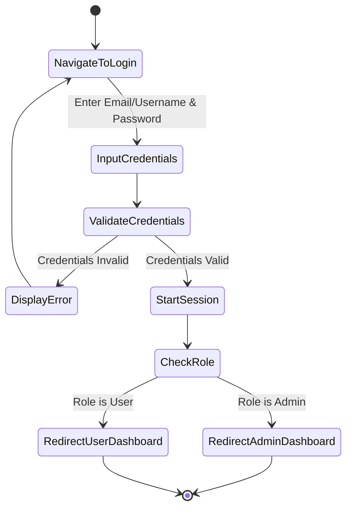
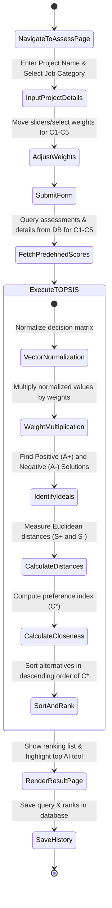
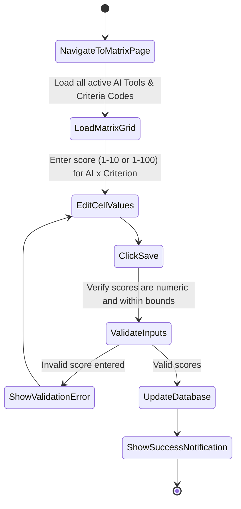

# Activity Diagram - AInsight (PHP Native)

This document details the activity workflows for core system processes in AInsight using Mermaid flowcharts.

---

## 1. User Authentication Workflow

This activity describes the login process for users entering the system and role-based direction.

---

## 2. Assessment & TOPSIS Calculation Workflow

This activity describes how a user performs an evaluation, how the TOPSIS engine computes rankings, and how the results are stored.

---

## 3. Admin Matrix Assessment Workflow

This activity describes how the Admin inputs performance ratings for each AI tool under the criteria.

