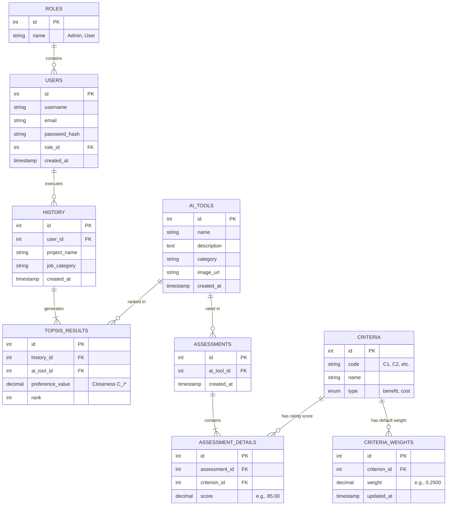

# Entity Relationship Diagram (ERD) - AInsight (PHP Native)

This document describes the relational database structure for AInsight.

## 1. ERD Diagram

---

## 2. Table Schemas & Relational Integrity

### 2.1 USERS & ROLES
- **roles**: Defines permissions. Pre-seeded with `1` (Admin) and `2` (User).
- **users**: Stores accounts. Links to `roles` via `role_id` (FOREIGN KEY constraint with `ON DELETE RESTRICT` to prevent orphan user roles).

### 2.2 AI_TOOLS & CRITERIA
- **ai_tools**: Stores the list of AI tool alternatives being ranked (13 tools seeded initially).
- **criteria**: Defines the evaluation dimensions (Harga/Price, Kemudahan, Kecepatan, Kualitas, Fitur).

### 2.3 CRITERIA_WEIGHTS
- **criteria_weights**: Stores the default weights managed by the Admin. Links to `criteria` via `criterion_id` (FOREIGN KEY constraint with `ON DELETE CASCADE`).

### 2.4 ASSESSMENTS & DETAILS (Decision Matrix)
- **assessments**: Represents an evaluation event of an alternative. Links to `ai_tools` via `ai_tool_id` (FOREIGN KEY constraint with `ON DELETE CASCADE`).
- **assessment_details**: Stores the score of an AI tool against a criterion. Represents cell value $x_{ij}$ in decision matrix $X$. Links to `assessments` via `assessment_id` and `criteria` via `criterion_id` (FOREIGN KEY constraints with `ON DELETE CASCADE`).

### 2.5 HISTORY & TOPSIS_RESULTS
- **history**: Logs the user's assessment query (project name, category, and date).
- **topsis_results**: Stores final ranking scores ($C_i^*$) and rankings for historical lookups. Links to `history` via `history_id` (FOREIGN KEY constraint with `ON DELETE CASCADE`) and `ai_tools` via `ai_tool_id` (FOREIGN KEY constraint with `ON DELETE CASCADE`).
